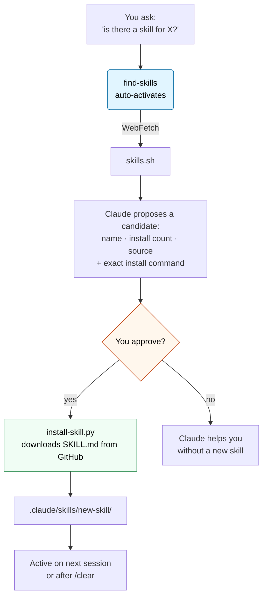
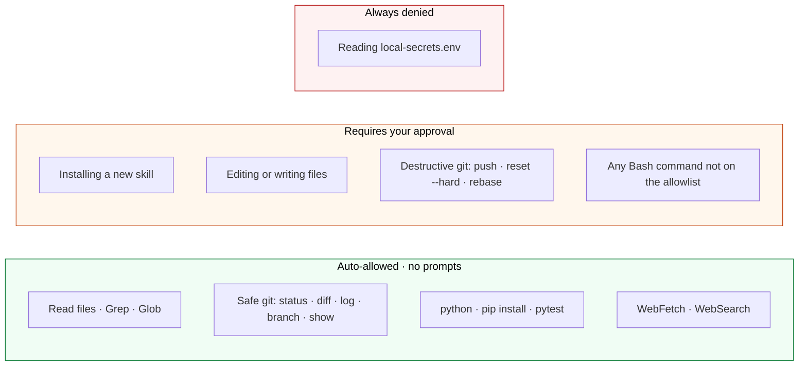

# Template-container

A template repository for creating Python development environments with dev container support, pre-configured with environment library and notebook support.

## Overview

This repository serves as a template for creating new projects that can be launched as dev containers on a Debian-based environment with Python pre-installed. It comes with two essential libraries:

- **ipykernel**: Enables Jupyter notebook support
- **python-dotenv**: Manages system environment variables


## Prerequisites

### Required: Local Secrets File

Before using this template, you **must** create a `secrets/local-secrets.env` file in your home directory on your host machine (even if it is empty).

The dev container will mount this file as read-only.

### Example local-secrets.env content:

```bash
# Required — git commit identity inside the container (used by setup-environment.sh):
GIT_USER_NAME=your_name
GIT_USER_EMAIL=you@example.com

# Required if you want Claude to install skills from private repos like jbdaudet/claude-skills:
GITHUB_PAT=your_github_personal_access_token

# Optional — add any other app secrets you need sourced into the container's env:
# ANTHROPIC_API_KEY=sk-ant-...
# AWS_ACCESS_KEY_ID=...
# AWS_SECRET_ACCESS_KEY=...
```

**File format rules** (bash `source` compatibility):
- One `KEY=VALUE` per line. No spaces around `=`.
- No YAML-style `KEY: VALUE`, no bare names on a line without `=`.
- Values with spaces or special characters need quotes: `KEY="some value"`.
- Comments start with `#`.

### Required: `.ssh` folder on your host

Before using this template, you **must** also have a `.ssh` folder in your home directory on your host machine (even if empty). The dev container bind-mounts it read-only and `setup-environment.sh` copies the contents into `/root/.ssh` with proper permissions (600 on private keys) — so `ssh`, `scp`, and `git` over SSH work inside the container using the same key paths you're used to on the host.

If the folder doesn't exist on your host, container creation will **fail at mount time**. Create it even if you have no keys yet:

- **Linux / macOS:** `mkdir -p ~/.ssh && chmod 700 ~/.ssh`
- **Windows (PowerShell):** `New-Item -ItemType Directory -Force -Path "$env:USERPROFILE\.ssh"`

If you already have private keys (e.g. `ec2-key.pem` for connecting to your AWS EC2), drop them in that folder. Inside the container they'll be available at `~/.ssh/ec2-key.pem` with mode `600`, so `ssh -i ~/.ssh/ec2-key.pem ec2-user@<host>` works out of the box.

The mount is **read-only**, so the container can never modify your host's keys.


## Customization

### Adding Dependencies

- **Public dependencies**: Add to `requirements.txt` with the version to add stability

### Environment Variables

Add your environment variables to `~/secrets/local-secrets.env` on your host machine. They will be automatically loaded during container setup.

### Extending the Container

Modify the `Dockerfile` to add additional system packages or configuration as needed for your specific project.
Example of needs:
- Install a browser and its driver to scrap using Selenium
- Install a Microsoft SQL driver to access SQL Server database
- Geographic package to use specific python library


## Claude Code Setup

This template ships a pre-configured [Claude Code](https://docs.claude.com/claude-code) environment. When you fork it, Claude is ready to go — no extra setup required.

### Big picture — what lives where

```
your-project/
│
├── CLAUDE.md                      ← Project memory, auto-loaded every Claude session
│
├── .claude/
│   ├── settings.json              ← Team-wide: permissions + safe-command allowlist (committed)
│   ├── settings.local.json        ← Your personal tweaks (gitignored)
│   └── skills/
│       └── find-skills/
│           └── SKILL.md           ← Auto-activates on "is there a skill for X?"
│
└── .devcontainer/
    └── install-skill.py           ← Python helper — installs a skill (no Node needed)
```

Four moving parts, each with one job:

| File | Role | One-liner |
|---|---|---|
| `CLAUDE.md` | Memory | Tells Claude what this project is, how to run it, and the rules. |
| `.claude/settings.json` | Permissions | Pre-approves safe commands so you're not prompted 50× a day. |
| `.claude/skills/find-skills/SKILL.md` | Discovery skill | Triggers when you wish you had a capability you don't yet have. |
| `.devcontainer/install-skill.py` | Installer | Pulls a skill from GitHub into `.claude/skills/<name>/`. |

### How discovering and installing a new skill works



The key gate is the orange diamond: **you** decide whether a skill gets installed, not Claude.

### Trust boundaries — what Claude can do without asking



The allowlist lives in [`.claude/settings.json`](.claude/settings.json) — edit it when you want to shift a command from amber to green.

### Adding a new skill — the 60-second version

1. Ask Claude *"is there a skill for …?"*. The `find-skills` skill activates and browses https://skills.sh.
2. Claude shows you a candidate (install count, source repo, install command).
3. You say yes. Claude runs:
   ```bash
   python3 .devcontainer/install-skill.py <owner>/<repo>:<skill>
   # or pinned to a specific commit for reproducibility:
   python3 .devcontainer/install-skill.py <owner>/<repo>:<skill>@<sha>
   ```
4. Commit the new `.claude/skills/<skill>/` folder so your team picks it up.

### Why installation is gated

A `SKILL.md` from a third-party repo becomes instructions Claude reads and follows — that's a prompt-injection surface. That's why the install command is **not** on the allowlist: Claude will always pause for your approval before writing third-party instructions into your repo. `find-skills` is configured to prefer skills with 1k+ installs and reputable sources, but the final call is yours.

### Browsing for skills yourself

You don't need Claude for discovery — browse https://skills.sh directly and run the same Python helper on anything that looks useful.

