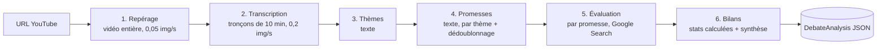

# Architecture du module « Vidéos »

## Vue d'ensemble



- Deux formats : **débat** (plusieurs orateurs politiques) et **discours de campagne** (un seul).
  Le format est imposé à la création (`kind`) ou détecté à l'étape 1 ; il ne change que la formulation
  des prompts et l'affichage (nombre de couloirs, bilans). Le débat est le cas le plus difficile
  (interruptions, paroles simultanées, attribution) ; le discours en est un sous-cas.
- La vidéo n'est **jamais téléchargée** : l'URL YouTube est passée directement à Gemini
  (vidéos publiques uniquement ; fonctionnalité en préversion côté Google).
- Chaque étape écrit son résultat dans `DebateAnalysis` puis l'enregistre : un traitement interrompu
  **reprend** à l'étape (et, pour la transcription, au tronçon) où il s'était arrêté.
- Toutes les réponses du modèle sont contraintes par un **JSON Schema** (sortie structurée).

## Les étapes

| # | Fichier | Entrée | Sortie | Garde-fous |
|---|---|---|---|---|
| 1 | `steps/survey.ts` | Vidéo entière, très peu d'images | Format, durée, titre, date, participants (`s1`, `s2`…) avec rôle et repères visuels | Format imposé prioritaire ; durée max (4 h par défaut) ; avertissement si le nombre d'orateurs politiques ne correspond pas au format |
| 2 | `steps/transcribe.ts` | Tronçons vidéo `[start, end]` + liste des participants | Segments `{start, end, speakerId, text}` | Identifiants d'orateur limités à la liste (sinon `unknown`) ; détection horodatage relatif/absolu ; bornage au tronçon |
| 3 | `steps/topics.ts` | Transcription condensée | Séquences `{title, start, end}` | Tri, dédoublonnage, fermeture sur la séquence suivante |
| 4 | `steps/extract.ts` | Transcription d'une séquence | Promesses `{segmentId, quote, statement, theme, specificity}` puis regroupement des répétitions | Orateur **toujours** pris dans le segment cité ; modérateurs écartés ; citation vérifiée dans le texte (`quoteVerified`) |
| 5 | `steps/evaluate.ts` | Reformulation de chaque promesse | `Evaluation` au format de l'analyseur du site | Scores bornés 0–10 ; sources filtrées par la liste blanche du site ; une erreur n'arrête pas les autres |
| 6 | `steps/summarize.ts` | Promesses évaluées d'un orateur politique | `SpeakerReport` | Chiffres calculés par le code ; consigne de neutralité ; pas de « gagnant » |

### Pourquoi ces choix

- **Repérage séparé de la transcription** : fixer une fois la liste des participants (avec leurs repères
  visuels et vocaux) évite que « Speaker A » d'un tronçon devienne « Speaker B » du suivant.
- **Images à 0,2 par seconde** pendant la transcription : assez pour voir qui est à l'écran, pour un coût
  modéré (l'audio pèse environ 32 jetons/s, une image en basse résolution 66 jetons).
- **Orateur pris dans le segment, jamais dans l'extraction** : attribuer une promesse au mauvais débatteur
  est l'erreur la plus grave possible. L'extraction ne fait que pointer un segment ; l'attribution vient
  de la transcription, et l'interface montre toujours la citation avec son horodatage.
- **Reformulation autonome (`statement`)** : c'est le texte soumis à l'évaluation, équivalent de ce qu'un
  visiteur taperait dans l'analyseur. Le nom du débatteur est passé en contexte mais l'évaluation porte
  sur la mesure.
- **Pas de note unique ni de classement** dans les bilans : la répartition des verdicts est montrée,
  ce qui limite le risque de paraître désigner un vainqueur.

## Modèle de données

Tout est dans `shared/debate-types.ts`. Résumé :

```
DebateAnalysis
├── kind         debate | speech
├── video        { videoId, url, title, channel, durationSec, airedOn }
├── speakers[]   { id: "s1", name, role: candidate|moderator|other, affiliation, cue }
├── transcript[] { id: "t1", start, end, speakerId, text }
├── topics[]     { id: "topic1", title, start, end }
├── promises[]   { id: "p1", speakerId, start, segmentId, quote, quoteVerified, statement,
│                  theme, topicId, specificity, repeats[], evaluation?, evaluationError? }
├── reports[]    { speakerId, stats, summary, strengths[], weaknesses[] }
├── completedSteps[], checkpoints, models, warnings[], createdAt, updatedAt
```

Les temps sont en secondes depuis le début de la vidéo.

## API HTTP

| Méthode | Route | Réponse |
|---|---|---|
| `GET` | `/api/debates` | `DebateListItem[]` |
| `GET` | `/api/debates/:videoId` | `DebateJobStatus` : `state` (`queued`, `running`, `done`, `error`), étape, progression, `analysis` |
| `POST` | `/api/debates` | Corps `{ url, kind?, speakerHints?, force? }`. `202` si lancé, `200` si déjà analysé, `400` URL invalide, `403` jeton admin manquant, `429` trop de lancements |

Le client interroge `GET /api/debates/:id` toutes les 3 s pendant le traitement.

## Configuration

Toutes les valeurs sont dans `server/debate/config.ts`, surchargeables par variables d'environnement
(liste dans `.env.example`). Les identifiants de modèles n'apparaissent **que** là.

Modèle par défaut : `gemini-3.8-flash`, recommandé par la documentation Gemini au 8 octobre 2026.

## Coûts (ordre de grandeur, débat de 3 h)

| Étape | Jetons en entrée | Remarque |
|---|---|---|
| Repérage | ~ 400 k | audio + 1 image / 20 s |
| Transcription | ~ 500 k | 18 tronçons ; ~ 60 k jetons en sortie |
| Thèmes + extraction + dédoublonnage | ~ 150 k | texte |
| Évaluations | ~ 30 × (5 k + recherches) | dépend du nombre de promesses |

Soit environ **1,2 M jetons en entrée et 200 k en sortie**, plus les requêtes Google Search, à multiplier
par la grille tarifaire en vigueur. Une analyse n'est faite qu'une fois par vidéo, puis servie depuis
le stockage. Offre gratuite de Google : 8 h de vidéo YouTube par jour au maximum.

## Limites connues et points à valider sur de vrais débats

- **Non testé contre l'API réelle** au moment de l'écriture (pas de clé disponible). Les paramètres ont été
  relevés dans les définitions de types du SDK `@google/genai` 2.24 et la documentation officielle.
  Premier test conseillé : un débat court (10–20 min).
- **Recherche Google** (évaluateur autonome) : **refusée sur une clé gratuite** (erreur 429 de quota, constaté
  le 8 octobre 2026, quel que soit le modèle). En mode `DEBATE_EVALUATION_SEARCH=auto` (défaut), l'évaluateur
  s'en passe dès le premier refus : l'évaluation est marquée `grounded: false`, sans sources, et l'interface
  l'indique. Avec la facturation activée, la recherche (et donc les sources) est utilisée. L'évaluateur du
  site (INTEGRATION.md § 4.4) remplace de toute façon celui-ci après fusion.
- **Horodatages** : constaté sur l'API réelle, le modèle renvoie des temps absolus (depuis le début de la
  vidéo) même pour un extrait ; on les demande donc ainsi, et `detectTimeBase` rattrape un éventuel tronçon relatif.
- **Paroles simultanées** : la transcription garde la voix principale. Les citations marquées
  `quoteVerified: false` sont signalées dans l'interface (« Citation à vérifier dans la vidéo »).
- **Débats à plus de deux orateurs** : gérés (un couloir par orateur, thèmes en haut), mais l'interface
  a été pensée pour deux.
- **Discours** : les personnes qui présentent l'orateur sont classées `other` et n'ont pas de couloir ;
  leurs propos restent dans la transcription.
- **Traitement en mémoire** : voir INTEGRATION.md § 4.7 pour Cloud Run.

## Tests

`npm test` (Vitest) :

- `tests/units.test.ts` : horodatages, URL YouTube, liste blanche des sources, vérification des citations,
  validation et fusion des promesses, statistiques des bilans ;
- `tests/pipeline.test.ts` : pipeline complet avec un **faux Gemini** (`FakeLlm`), reprise après interruption,
  détection et forçage du format discours, API HTTP (validation, jeton admin, cycle de vie d'une analyse).
